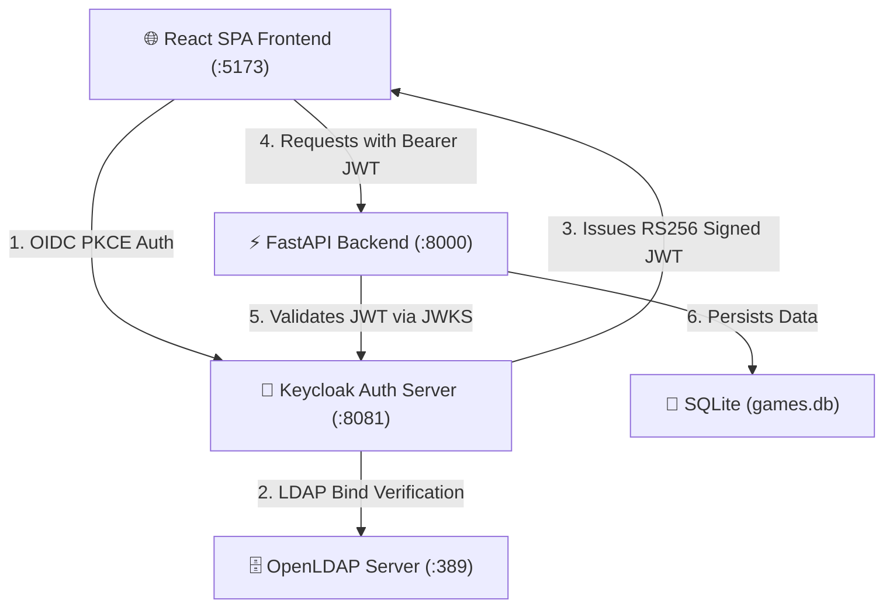

# 🔐 LDAP + Keycloak + OAuth 2.0 / OIDC PlayStation Dashboard

Complete Dockerized Laboratory Stack: **OpenLDAP** + **phpLDAPadmin** + **Keycloak** + **PostgreSQL** + **FastAPI** + **React Frontend**.

---

## 🏗️ Architecture Overview



---

## 🚀 Quick Start

1. **Start all Docker services:**
   ```bash
   docker compose up -d --build
   ```

2. **Load LDAP users (`alice` and `bob`):**
   - Windows PowerShell:
     ```powershell
     .\load-ldap-users.ps1
     ```
   - Linux / macOS / Git Bash:
     ```bash
     ./load-ldap-users.sh
     ```

---

## 🌐 URLs & Ports

- **React Frontend Dashboard:** [http://localhost:5173](http://localhost:5173)
- **Keycloak Admin Console:** [http://localhost:8081](http://localhost:8081) (`admin` / `adminpassword`)
- **FastAPI Swagger Docs:** [http://localhost:8000/docs](http://localhost:8000/docs)
- **phpLDAPadmin:** [http://localhost:8080](http://localhost:8080)

---

## 🔑 Test LDAP Credentials

| Username | Password | Role / Scope |
| :--- | :--- | :--- |
| `alice` | `alice123` | LDAP User (`ou=users,dc=example,dc=com`) |
| `bob` | `bob123` | LDAP User (`ou=users,dc=example,dc=com`) |

---

## 📦 GitHub Repositories

This project is separated into 3 dedicated GitHub repositories for grading:

1. **Docker Stack (LDAP + Keycloak):** [https://github.com/BlackBoxUwU/ldap-keycloak-oauth2-lab](https://github.com/BlackBoxUwU/ldap-keycloak-oauth2-lab)
2. **FastAPI Backend:** [https://github.com/BlackBoxUwU/fastapi-backend-ldap-oauth](https://github.com/BlackBoxUwU/fastapi-backend-ldap-oauth)
3. **React Frontend:** [https://github.com/BlackBoxUwU/react-playstation-dashboard-ldap-oauth](https://github.com/BlackBoxUwU/react-playstation-dashboard-ldap-oauth)
